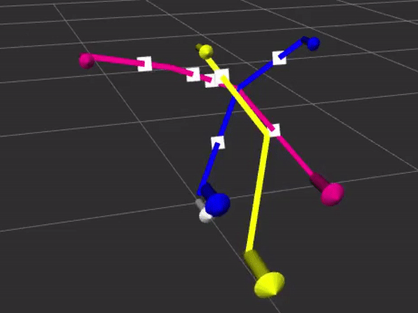

# PSC Drones

This repository contains an implementation of an algorithm to generate coordinated drone trajectories avoinding collisions and optimizing time. It runs on simulated and real Crazyflie drones.



## Installation

Make sure you have Ubuntu 16 installed.

First create a workspace folder and clone this repository (Installation scripts require it to be this exact directory).
```
mkdir -p ~/catkin_ws/src
cd ~/catkin_ws/src
git clone https://github.com/asilvaigor/psc.git
```

Next install ROS and create a ROS workspace by running:
```
cd ~/catkin_ws/src/psc/configuration/
./install_ros.sh
```

Then run:
```
./install_crazyflie.sh
./configure_usb.sh
```

Download and buid mesh_generator repository:
```
./install_mesh_generator.sh
```

Update current shell:
```
source ~/.bashrc
```

## Running 
```
roslaunch psc agent.launch
```

If this doesn't work, try using a new terminal shell.

## Configure PyCharm
Open the project on `~/catkin_ws/src/psc` folder.
To configure python paths inside pycharm, go on `File>Settings>Project>Project Interpreter`. Make sure you select python2.7 (`/usr/bin/python2.7`). Click on the gear button, then "Show All". Select the last button (tree), than add a path to `catkin_ws/src/sim_cf/crazyflie_gazebo/tools` and one to `catkin_ws/src/psc/src/`.

